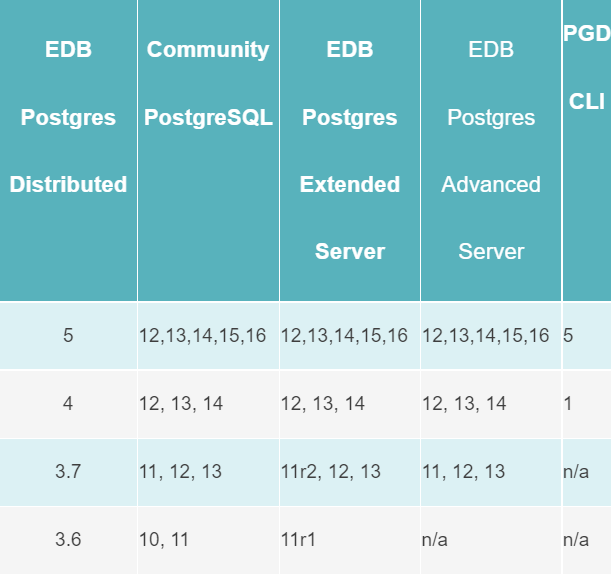

# PGD 各版本兼容性列表

上篇我们对 PGD 的 Always On 架构做了基本简介，本篇主要介绍 PGD 不同版本对 Linux 和 PostgreSQL 的各版本兼容性介绍，以及 PGD 在规划设计时的一些限制性介绍。

  

 **PGD各版本兼容性列表**

  

- EDB Postgres Distributed 4.x 使用 High Availability Routing for Postgres (HARP) 进行集群管理，HARP 的支持信息与 PGD 4.x 相同

- Postgres 16 support is only available in EDB Postgres Distributed 5.3 and later

- PGD 5.x HARP Manager 已不复存在。它已被新的连接管理配置PGD-Proxy所取代。HARP 代理被功能类似的 PGD 代理所取代，该代理删除了所有已弃用的功能，并通过连接管理配置进行配置

  

 **PGD对PG兼容性矩阵**

  

- BDR 4.1 及更高版本支持 PGD CLI 1。BDR 3.7.15 及更高版本以及 4.0.1 及更高版本支持 HARP 2 中的 BDR DCS

- EDB Postgres Distributed (includes pgLogical 3.7.x and BDR 3.7.x) 标准支持终止：2023 年 6 月 2 日

  

 **Limitations限制**

  

在规划部署时，请考虑这些 EDB Postgres Distributed （PGD） 设计限制。 

 **Nodes 节点**

PGD可以运行数百个节点，前提是有足够的硬件和网络。但是，对于基于网格的部署，我们通常不建议在一个集群中运行超过 48 个节点。如果您需要超出 48 个节点限制的额外读取可扩展性，您可以添加仅限订阅者subscriber-only的节点，而无需参与mesh网络的连接。

一个组中建议的最小节点数为 3 个，以便为 PGD 的共识机制提供容错能力。只有两个节点，如果其中一个节点没有响应，共识就会失败。某些 PGD 操作需要达成共识，例如分布式序列生成。

 **Multiple databases on single instances单个实例上的多个数据库**

从 PGD 5 开始，不推荐对同一 Postgres 实例上的多个数据库使用 PGD 的支持，并且 PGD 6 将不再支持。随着产品功能的扩展，在操作和功能上引入的复杂性在多数据库设计中不再可行。

这是最佳实践，我们建议您仅为每个 PGD 实例配置一个数据库。

使用 TPA 的部署自动化以及 CLI 和 PGD 代理等工具已经建议编入标准规范。

虽然仍然可以在一个实例中托管多达 10 个数据库，但这样做会带来许多直接风险和当前限制：

  * 如果需要更改 PGD 配置，那么必须对每个数据库执行管理命令。这样做会增加潜在的不一致和错误的风险。

  * 您必须单独监视每个数据库，这会增加开销。

  * TPAexec假定只部署一个数据库。如果要设置更多数据库复制，客户或 EDB 专业服务团队需要在部署后进行额外编码。

  * PGD 代理在 Postgres 实例级而非数据库级运行，这意味着所有数据库的领导节点都是相同的。

  * 每个额外的数据库都会增加服务器上的资源需求。每个数据库都需要自己的一组工作进程来维护复制，例如逻辑工作进程、WAL 发送方和 WAL 接收方。每个实例还需要自己的一组与复制集群中其他实例的连接。这些需求可能会严重影响所有数据库的性能。

  * 同步复制方法（例如 CAMO 和 Group Commit）将无法按预期工作。由于 Postgres WAL 在数据库之间共享，因此异步提交确认可以来自任何数据库，不一定按正确的提交顺序。

  * CLI 和 OTEL (Open Telemetry)集成（v5 中的新功能）假定针对一个数据库。  

 **Durability options (Group Commit/CAMO)   持久性选项（Group Commit/CAMO）**

PGD 持久性选项的工作方式存在多种限制；这涵盖了 Group Commit 和 CAMO 以及它们如何与 PGD 功能（例如 WALdecoder 和事务流）一起运行。

此外，与遗留同步复制的互操作性、与显式两阶段提交的互操作性以及提交范围规则内不支持的组合也存在限制。

 **Mixed PGD versions  混合 PGD 版本**

PGD 的开发目的是通过允许 PGD 的混合版本在升级过程中运行来实现 PGD 的滚动升级。我们希望用户仅在升级期间运行混合版本，并且一旦升级开始，他们就会完成升级。我们不支持运行混合版本的 PGD（升级期间除外）。

 **其他限制**

如果您在回滚事务中创建序列，然后使用相同名称再次创建该序列，则 galloc 序列可能会跳过一些块。如果您在 DDL 复制未处于活动状态时创建并删除序列，然后在 DDL 复制处于活动状态时再次创建该序列，则也可能会发生跳过块的情况。该问题的影响很轻微，因为没有违反顺序保证。这些序列仅跳过一些初始块。此外，作为解决方法，您可以将序列的起始值指定为 bdr.alter_sequence_set_kind() 函数的参数。
