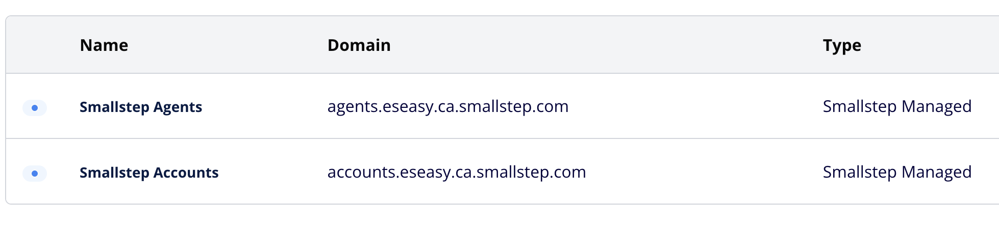
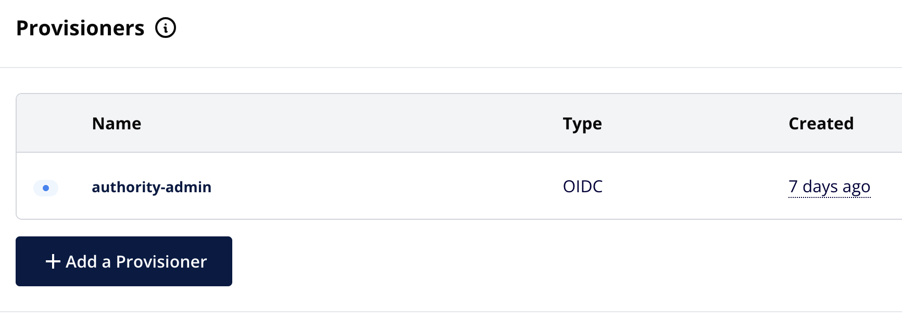
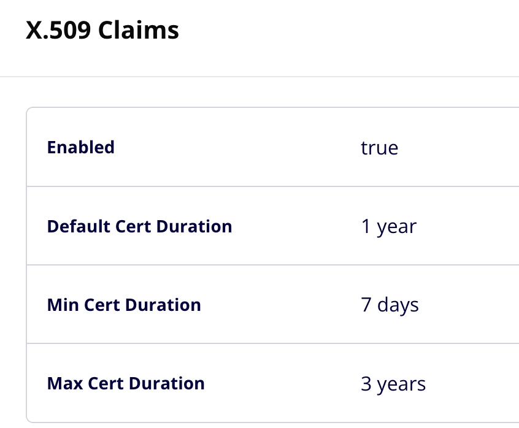
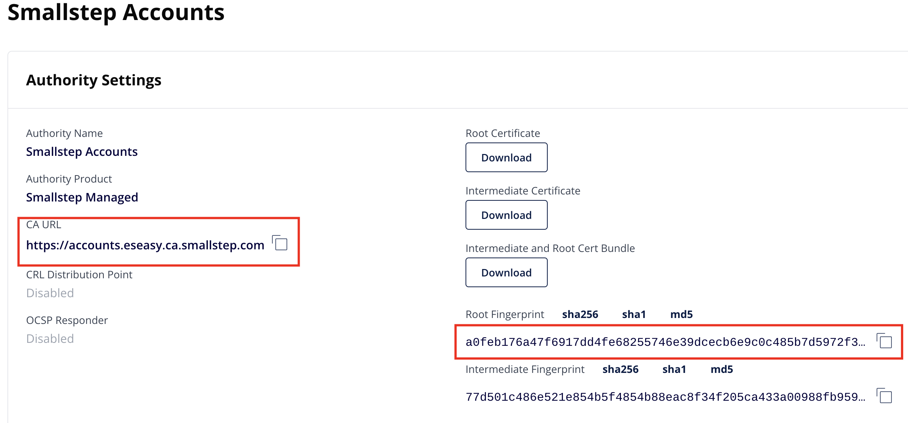
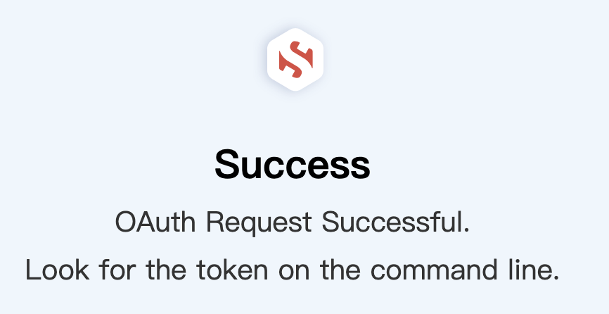
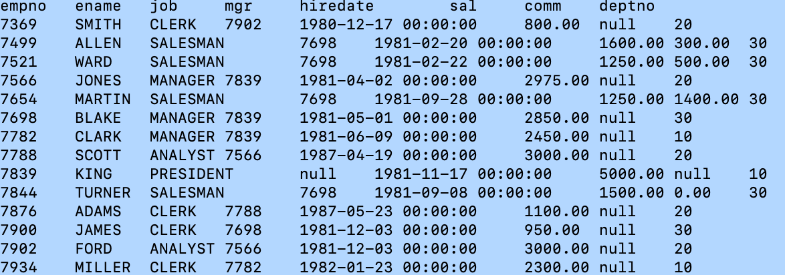

# EDB EPAS利用smallstep证书实现mTLS双向安全连接

Smallstep是一个开源的身份和证书管理工具，旨在简化和自动化数字证书的生成、签署和管理。它为开发者、运维团队和企业提供了一种灵活且易于使用的方式，来处理证书的生命周期管理，支持
TLS/SSL 认证、加密密钥管理以及实现无缝的身份验证和访问控制。

smallstep证书尤其适合于实验室内没有公共域名的环境中，支持任意域名的设定，如"example.com"等。

本文我们使用smallstep生成的EDB EPAS证书及psql客户端证书，来实现EPAS的mTLS双向安全认证连接。

# 一 smallstep简介

Smallstep是一个功能强大且易于使用的工具，帮助开发者和运维人员简化证书管理和身份验证过程。它支持自动化证书的创建、管理和续期，且能够有效集成进现代DevOps 环境中。通过 step-ca 和step-cli，用户可以搭建自己的证书管理平台，保障应用和服务的安全通信。

## 1.1 核心功能

**证书颁发：**

-   Smallstep 提供了简化的工具，可以为服务、应用程序、设备或用户生成 TLS
    证书（包括 X.509 证书）。

-   它支持使用 step-ca（Smallstep 的证书颁发机构）来颁发证书，并可以自定义证书模板来满足特定需求。

**自动化证书管理：**

-   Smallstep 支持自动化证书的申请、续期和撤销。它可以通过命令行工具step 来进行证书操作，或者通过 REST API 实现集成。
    
-   它还提供 Smallstep Agent，可以用于自动化证书的获取和更新，适用于大规模的环境和动态基础设施。

**mTLS（双向 TLS）：**

-   Smallstep 使得在客户端和服务器之间实现双向 TLS 认证变得简单。它生成的证书可以用于支持基于证书的身份验证，实现更高的安全性。

**多种认证机制：**

-   除了常规的 SSL/TLS 证书外，Smallstep 还支持使用 JWT（JSON Web Token）进行身份验证，适用于微服务和 API 的安全认证。
    
-   它还支持与其他认证和授权系统集成，例如与 OpenID Connect 或 OAuth 2.0 配合使用。

**私有证书颁发机构：**

-   Smallstep 提供的 step-ca 可以帮助企业或团队搭建自己的私有证书颁发机构（CA）。这种架构适用于需要内部控制和管理的场景。

**灵活的证书生命周期管理：**

-   Smallstep发提供了强大的工具来管理证书的生命周期，从创建证书、配置证书到撤销和过期。证书可以被标记为信任，管理密钥的权限和访问控制策略。

## 1.2 核心组件

**step-ca：**

-   Smallstep 的证书颁发机构（CA），用于创建和签发证书。

-   它支持证书模板、证书撤销、证书吊销列表（CRL）等功能。

**step-cli：**

-   step 命令行工具，用于与 step-ca
    交互，生成证书、管理密钥、申请证书等。

**Smallstep Agent：**

-   小步骤代理，主要用于自动化证书请求和更新。它可以安装在客户端或服务器上，以便自动获取和更新证书。

**step-certificates：**

-   提供管理证书的界面，支持直接下载、上传和查看证书。

## 1.3 使用场景

**TLS/SSL 加密：**

-   为 Web 服务、API、数据库等系统提供加密通信。

**mTLS 认证：**

-   在服务间实现强身份验证（双向 TLS），保障通信双方的身份真实性。

**私有 CA 部署：**

-   创建和管理私有证书颁发机构，特别适合在企业内部管理私有证书。

**DevOps 和自动化：**

-   自动化证书申请和管理，适用于容器化应用、微服务架构以及动态环境中的证书管理。

# 二 证书创建

## 2.1 申请smallstep帐号及Authorities

以个人邮箱申请smallstep帐号，smallstep会让你创建Team信息和Team
ID，按帐号注册提示输入自己相应信息。完成后它会给你自动生成Authorities下的两个帐号，smallstep
accounts（用于身份管理和认证的工作）和smallstep
agents（用于自动化证书请求、安装和管理）。

{width="5.768055555555556in"
height="1.3138888888888889in"}

不考虑未来生成证书自动更新，所以在帐号smallstep
accounts下创建一个自己的provisioners（供应者）-authority-admin，用于定义自己证书的生命周期管理。

{width="5.768055555555556in"
height="2.045138888888889in"}

定义默认证书有效期为一年

{width="2.994247594050744in"
height="2.4704516622922137in"}

## 2.2 本地安装step cli客户端证书生成工具，

macos系统下载：

```
$ brew install step
```


## 2.3 配置step使用authority

```
$ step ca bootstrap --ca-url https://accounts.eseasy.ca.smallstep.com
--fingerprint a0feb176a47f6917dd4fe68255746e39dcecb6e9c0c485b7d5972f3c7315e5fb
```

上述参数来自smallstep accounts配置

{width="5.768055555555556in"
height="2.692361111111111in"}

命令本地生成证书及配置的本地下载

```
~/.step/authorities/accounts.eseasy.ca.smallstep.com/certs/root_ca.crt
~/.step/authorities/accounts.eseasy.ca.smallstep.com/config/defaults.json
```

至此本地证书生成环境已经就绪。

# 三  生成EPAS数据库证书

## 3.1 为EPAS创建私有密钥并请求证书

```
$ step ca certificate "epas-1.test.cxm" server.crt server.key
```

通过浏览器实现OAuth 请求认证

{width="5.768055555555556in"
height="2.970833333333333in"}

在当前目录下创建了server.crt 和 server.key

可以通过命令查看生成的证书有效期为默认设置的1年。

```
$ step certificate inspect server.crt --short
```

```
X.509v3 TLS Certificate (ECDSA P-256) [Serial: 1423...4703]

Subject: epas-1.test.cxm

Issuer: Smallstep Accounts Intermediate CA

Provisioner: authority-admin [ID: 2123...8911]

Valid from: 2025-01-16T18:50:27Z

to: 2026-01-16T18:51:27Z
```

生成根证书root.crt

```
$ step ca root root.crt --ca-url https://accounts.eseasy.ca.smallstep.com --fingerprint
a0feb176a47f6917dd4fe68255746e39dcecb6e9c0c485b7d5972f3c7315e5fb
```

当前目录下生成3个文件： root.crt，server.crt和server.key

## 3.2 创建客户端psql请求证书

```
$ step ca certificate "enterprisedb" client.crt client.key
```

生成的psql客户端证书为client.crt和client.key中。

**注意：制作的证书时用数据库用户enterprisedb作为subject来生成。按需修改为自己需要的连接用户。**

## 3.3 配置EPAS用TLS证书认证

### 3.3.1 编辑postgresql.conf文件以激活SSL

现在，我们设置EPAS服务器使用上一步中颁发的证书来配置，并强制客户端通过
TLS 进行连接。

要以 SSL 模式启动 EPAS，首先在postgresql.conf中启用 SSL。

```
# ...
ssl = on
# ...
```

将server.crt和server.key文件及root.crt放入安装的数据目录中，通常位于
/var/lib/edb/as16/data处。确保它们的文件名分别为 server.crt 和
server.key，这是预期的默认值。同时需要确保enterprisedb有权访问这些文件并设置私钥文件权限以禁止组或other访问。

从客户端scp证书到数据库服务器。

```
$scp server.crt enterprisedb@epas-1.test.cxm:/var/lib/edb/as16/data/server.crt
$scp server.key enterprisedb@epas-1.test.cxm:/var/lib/edb/as16/data/server.key
$scp root.crt enterprisedb@epas-1.test.cxm:/var/lib/edb/as16/data/root.crt
```

在EPAS服务器上,修改证书的属主及私钥权限。

```
$ sudo chown enterprisedb:enterprisedb /var/lib/edb/as16/data/server.{crt,key}
$ sudo chown enterprisedb:enterprisedb /var/lib/edb/as16/data/root.crt
$ sudo chmod 0600 /var/lib/edb/as16/data/server.key
```

然后在postgresql.conf中设定证书路径，配置如下：

```
# - SSL -
ssl = on
ssl_ca_file = 'root.crt'
ssl_cert_file = 'server.crt'
ssl_crl_file = ''
ssl_key_file = 'server.key'
ssl_ciphers = 'HIGH:MEDIUM:+3DES:!aNULL' # allowed SSL ciphers
ssl_prefer_server_ciphers = on
```

保存更改后，需要重启数据库服务器

### 3.3.2 pg_hba.conf文件为客户端添加认证条目

```
[enterprisedb@epas-1 data]$ vi pg_hba.conf
```

```
#添加ssl认证条目
hostssl all all all cert
```

重启EPAS数据库服务器。

## 3.4 测试客户端的SSL连接

```
$ psql "host=192.168.31.101 port=5444 dbname=edb user=enterprisedb
sslmode=verify-full sslcert=./client.crt sslkey=./client.key
sslrootcert=./root.crt"
```

```
psql: 错误: 连接到"192.168.31.101"上的服务器，端口5444失败：server
certificate for "epas-1.test.cxm" (and 1 other name) does not match
host name "192.168.31.101"
```

连接错误，是指证书主机名不对。我们修改host为生成证书时的服务器名来连接测试。

```
$ psql "host=epas-1.test.cxm port=5444 dbname=edb user=enterprisedb
sslmode=verify-full sslcert=./client.crt sslkey=./client.key
sslrootcert=./root.crt"
```

```
psql (16.6 (Homebrew), 服务器 16.3.0)
警告：psql 主版本16,服务器主版本为16.
一些psql功能可能无法正常使用.
SSL connection (protocol: TLSv1.3, cipher: TLS_AES_256_GCM_SHA384,
compression: 关闭)
输入 "help" 来获取帮助信息.
edb=#
```

成功通过证书无密码实现安全的SSL客户端连接。此处告警是提示client版本和服务器版本不一致。

#  四 测试SSL的JDBC连接

## 4.1 在java程序中，确保设置以下属性

```
props.setProperty("ssl","true");
```

或者在连接的url中指定

```
String url ="jdbc:postgresql://localhost/test?user=fred&password=secret&ssl=true";
```


## 4.2 修改后重新编译java程序

为了使服务器证书可用于 Java，请将其转换为 Java 格式：

```
$ openssl x509 -in server.crt -out server.crt.der -outform der
```


## 4.3 将证书导入java的系统信任库：

```
	$sudo keytool -keystore $JAVA_HOME/lib/security/cacerts -alias epas
-import -file server.crt.der -storepass changeit
```

```
Warning: use -cacerts option to access cacerts keystore
Owner: CN=epas-1.test.cxm
Issuer: CN=Smallstep Accounts Intermediate CA
Serial number: c7dbb42c5bef4472c58c0931efb29622
Valid from: Fri Jan 17 01:24:48 CST 2025 until: Sat Jan 17 01:25:48 CST
2026
Certificate fingerprints:
SHA1: 61:3F:05:2C:40:EC:7A:6D:C6:B7:A2:A5:B1:43:87:D9:F1:BE:DC:17
SHA256:
D8:95:B1:CD:DC:D0:31:F4:41:34:8A:D0:70:92:E3:DC:72:A0:0A:ED:21:E8:B3:D1:06:F7:C8:A2:E5:B0:23:C7
Signature algorithm name: SHA256withECDSA
Subject Public Key Algorithm: 256-bit EC (secp256r1) key
Version: 3
......
Trust this certificate? [no]: yes
Certificate was added to keystore
```

如果用户无权访问系统证书信任库，则可以按如下方式创建个人信任库：

```
$ keytool -keystore mystore -alias epas -import -file server.crt.der
```

## 4.4 转换客户端私钥为DER格式

```
openssl pkcs8 -topk8 -outform DER -in client.key -out client.key.pk8 -nocrypt
```

修改java程序连接参数，基于上篇的jdbc_select_list.java程序修改，如下：

```
import java.sql.*;
import java.util.Properties;
public class jdbc_select_list_ssl {
	public static void main(String[] args) {
		try {
			// 加载 EDB JDBC 驱动
			Class.forName("com.edb.Driver");
			// 数据库连接参数
			String url = "jdbc:edb://epas-1.test.cxm:5444/edb";
			Properties props = new Properties();
				props.setProperty("user","enterprisedb");
				props.setProperty("ssl","true");
				props.setProperty("sslmode","verify-full");
				props.setProperty("sslcert","/home/nuser/jdbctest/client.crt");
				props.setProperty("sslkey","/home/nuser/jdbctest/client.key.pk8");
				props.setProperty("sslrootcert","/home/nuser/jdbctest/root.crt");
				// 建立连接
				Connection con = DriverManager.getConnection(url,props);
				// 创建 SQL 语句
				Statement stmt = con.createStatement();
				// 执行查询
				ResultSet rs = stmt.executeQuery("SELECT * FROM emp");
				// 获取列数和列名
				ResultSetMetaData rsMetaData = rs.getMetaData();
				int columnCount = rsMetaData.getColumnCount();
				// 打印列名
				for (int i = 1; i <= columnCount; i++) {
					System.out.print(rsMetaData.getColumnName(i) + "t");
				}
				System.out.println();
				// 遍历结果集并打印每行数据
				while (rs.next()) {
					for (int i = 1; i <= columnCount; i++) {
						System.out.print(rs.getString(i) + "t");
					}
					System.out.println();
				}
				// 关闭资源
				rs.close();
				stmt.close();
				con.close();
				System.out.println("Command successfully executed");
		} catch (ClassNotFoundException e) {
				System.out.println("Class Not Found: " + e.getMessage());
		} catch (SQLException exp) {
				System.out.println("SQL Exception: " + exp.getMessage());
				System.out.println("SQL State: " + exp.getSQLState());
				System.out.println("Vendor Error: " + exp.getErrorCode());
		}
	}
}
```

红色标注为修改部分，另存为jdbc_select_list_ssl.java

## 4.5 编译java程序并测试连接

```
$ java -Djavax.net.ssl.trustStore=~/mystore -Djavax.net.ssl.trustStorePassword=cary.jin jdbc_select_list_ssl.java public
```

{width="5.768055555555556in"
height="2.0243055555555554in"}

测试ssl连接成功

提示：如果连接有问题，可以在java命令中增加-Djavax.net.debug=ssl参数调试连接失败具体原因。
